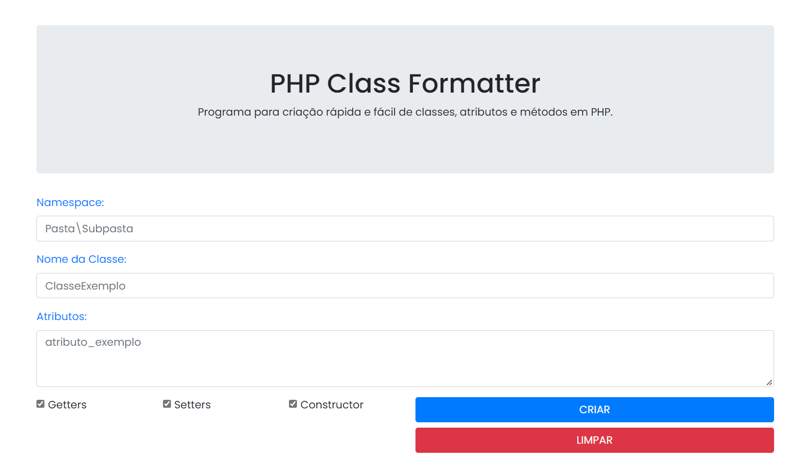

## Apresentação Geral

**Nome do Projeto:** PHP Class Formatter

**Descrição:**

Essa ferramenta pode ser executada a partir de qualquer navegador e facilita a criação automática de uma classe PHP com método construtor, getters e setters, a partir de uma simples lista de atributos.

Personalize o namespace e o nome da classe, insira os atributos desejados e crie a classe com apenas alguns cliques!

Após a criação, você pode copiar o código gerado ou salvar em um arquivo para uso futuro.



**Objetivo:**

Implementar uma interface intuitiva que simplifique e automatize a criação de classes PHP.

**Tecnologias Utilizadas:**


## Como Usar

O preenchimento dos campos "Namespace" e "Nome da Classe" é opcional, mas pelo menos um atributo deve ser informado para que a classe seja gerada.
Os atributos podem ser inseridos de diferentes maneiras:

- Separados por quebras de linha:
```
atributo1
atributo_2
```

- Separados por espaços em branco:  
```
atributo1 atributo_2
```

- Ou uma combinação dos dois:
```
atributo1 atributo_2
atributo_3 atributo4
```

Observação: Os nomes dos atributos não podem conter caracteres especiais ou espaços.

## Exemplo


> Código copiado:
```php
<?php
	namespace Pasta\Subpasta;

	class ClasseExemplo {

		private $teste;

		public function __construct($teste = '') {
			$this->teste = $teste;
		}

		public function setTeste($teste){
			$this->teste = $teste;
		}

		public function getTeste() {
			return $this->teste;
		}

	}
?>
```

## Contato

[](https://github.com/edssaac)
[](mailto:edssaac@gmail.com)
[](mailto:edssaac@outlook.com)
[](https://www.linkedin.com/in/edssaac/)
