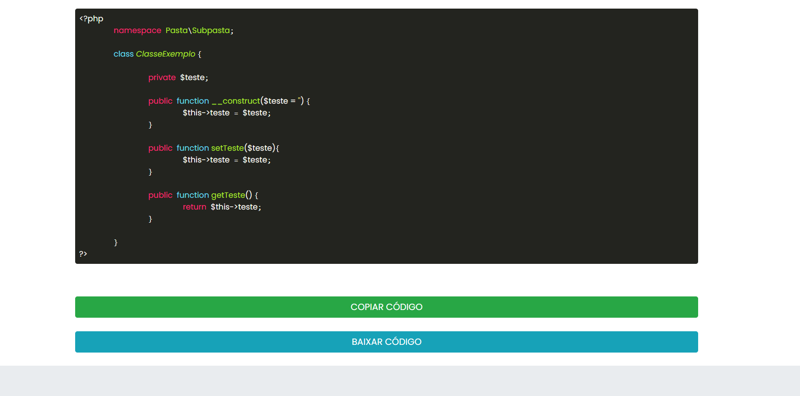

<div align="center">
        <h1>PHP Class Formatter</h1>
</div>

<div>
    <p>Essa ferramenta pode ser execultada a partir de qualquer navegador e permite a construção automática de uma classe PHP com método construtor, getters e setters a partir de uma simples lista de atributos.</p>
</div>

<div>
    <p>Se desejável, edite o namespace e o nome da classe, insira a lista de atributos que a classe deve conter e a crie com poucos cliques! 
    <br>Após isso, se sinta livre para copiar o código criado ou até mesmo salvar em um arquivo.</p>
</div>

<div align="center">
    
</div>

## Modo de usar:
<div>
    <p>Os atributos podem estar separados por quebra de linha:</p>
        
```
atributo1
atributo_2
```
</div>

<div>
    <p>Separados por espaço em branco:</p>
        
```
atributo1 atributo_2
```
</div>

<div>
    <p>Ou separados pelos dois jeitos:</p>
        
```
atributo1 atributo_2
atributo_3 atributo4
```
</div>

## Exemplo de código gerado pela ferramenta:
<div align="center">
    
</div>

## Código copiado:
```php
<?php
	namespace Pasta\Subpasta;

	class ClasseExemplo {

		private $teste;

		public function __construct($teste = '') {
			$this->teste = $teste;
		}

		public function setTeste($teste){
			$this->teste = $teste;
		}

		public function getTeste() {
			return $this->teste;
		}

	}
?>
```
